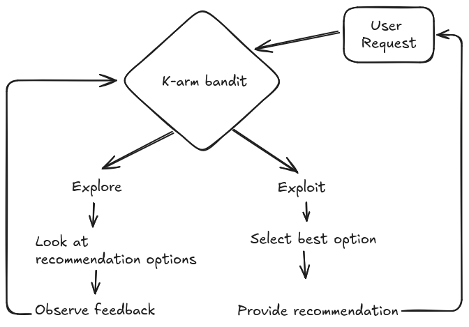

### Recommendation system using K-arm bandit

The K-arm bandit solution for a recommendation system involves the following components and functions
- User Request 
- K-Arm Bandit
- Explore & Exploit
- Observing the user feedback
- Updating the bandit model

The idea is that we would have different items(K-arm) that we will recommend to users. each item has an unknown probability.The goal is to give successful recommendations over a period of time.

Each time a user requests a recommendation,we have to decide which item to recommend. When we recommend an item, we observe whether the user likes it or not . Over time, we get to learn which items tend to be more popular or successful amongst the user.

Here is the System Architecture:
- 